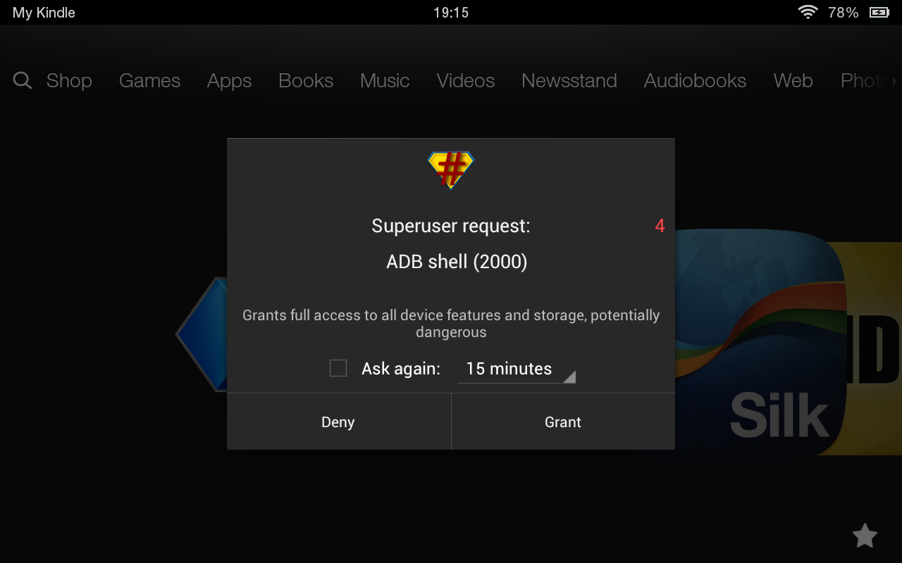
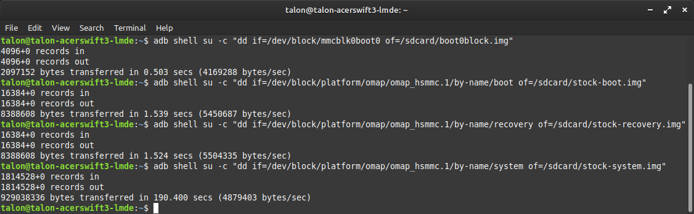
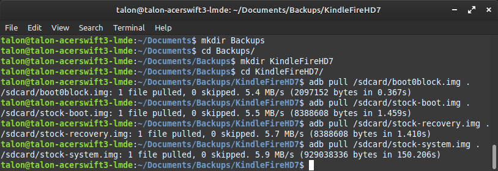

# Making a Backup
Backing up the boot0 block, boot partition, recovery partition, and system partition.

I'll assume you read [/Guide_Root/README.md](/Guide_Root/README.md) and know that you'll run `adb` from your computer to run commands on your Kindle Fire (connected via cable or wirelessly).

Everything here is basically the section "MAKING A BACKUP" on the website https://rubenalamina.mx/2014/02/26/how-to-root-the-kindle-fire-hd-to-install-a-custom-rom/  
(written by [Ruben](https://rubenalamina.mx/author/ruben/) on 2014-02-26)  
but with screenshots I made of my experience.

```bash
adb shell su -c "dd if=/dev/block/mmcblk0boot0 of=/sdcard/boot0block.img"
adb shell su -c "dd if=/dev/block/platform/omap/omap_hsmmc.1/by-name/boot of=/sdcard/stock-boot.img"
adb shell su -c "dd if=/dev/block/platform/omap/omap_hsmmc.1/by-name/recovery of=/sdcard/stock-recovery.img"
adb shell su -c "dd if=/dev/block/platform/omap/omap_hsmmc.1/by-name/system of=/sdcard/stock-system.img"
```

When you begin, you'll be asked to grant root permissions on your Kindle Fire:



You'll wanna tap "Grant". Make sure to tap it before the pop-up dismisses (note
the red number on the right, it counts down)

The first 3 commands will only take around 1 second each. The last one will take
longer. Here's how long each took for me:



After all that's done, copy over the files to your computer. First make a folder
somewhere and `cd` to it. Here are the commands to copy the 4 `img` files we
made to your current working directory:

```bash
adb pull /sdcard/boot0block.img .
adb pull /sdcard/stock-boot.img .
adb pull /sdcard/stock-recovery.img .
adb pull /sdcard/stock-system.img .
```

And my terminal output:


