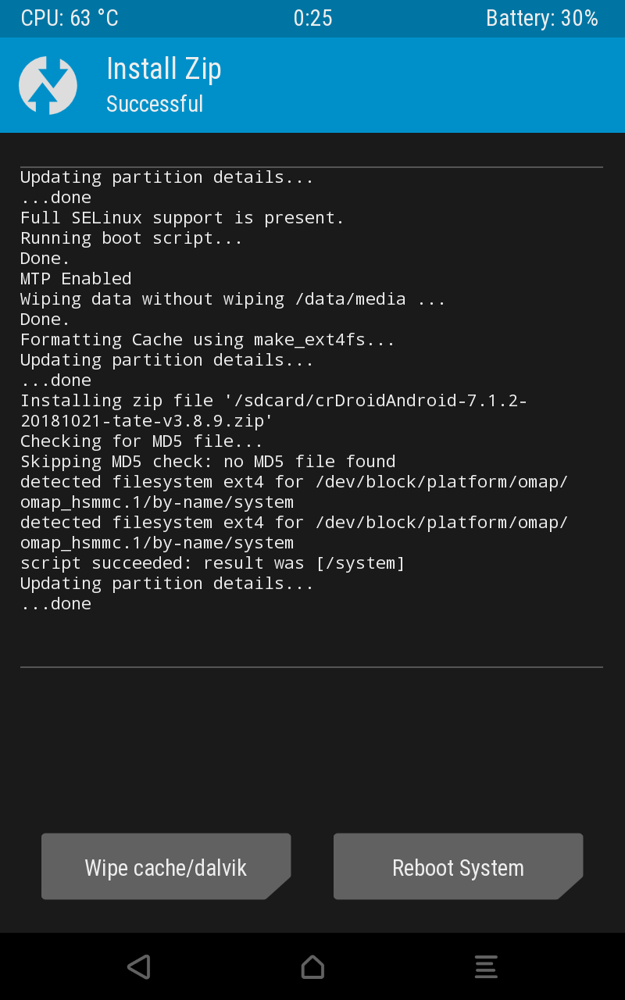
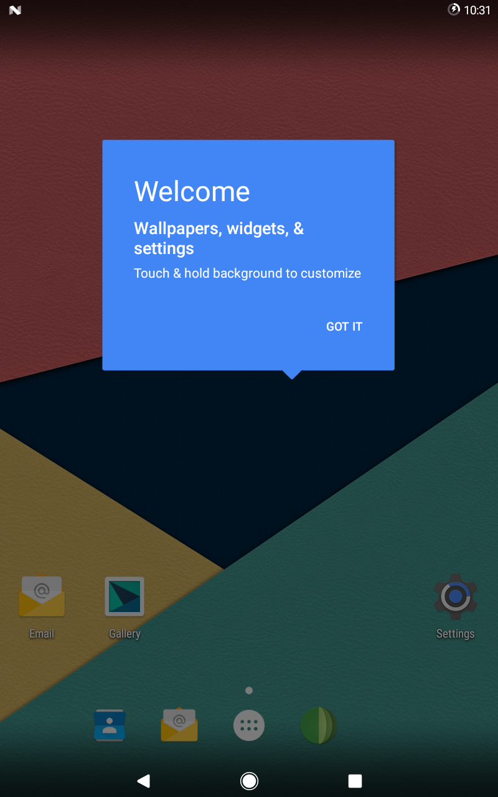
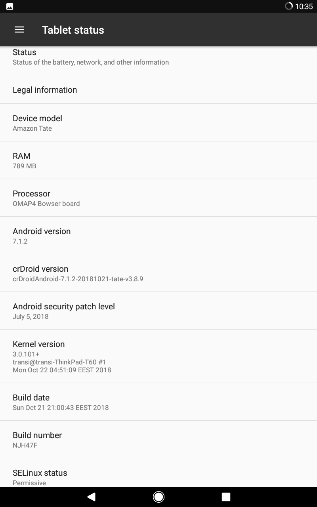

# Trying out custom ROMs

## crDroidAndroid-7.1.2-20181021-tate-v3.8.9.zip
From https://www.mediafire.com/folder/u7sb7p10ik7v0/tate
mentioned on
https://xdaforums.com/t/howto-how-to-install-a-new-os-on-7-kindle-fire-hd-2012-tate.3930149/

I downloaded the ZIP, then put it on the Kindle.

Then I booted into TWRP.

1. Wipe > Swipe to Factory Reset
2. Back, Back
3. Install > Select the ZIP > Swipe to confirm Flash

Now I tapped "Reboot System".

Waiting... (blue Kindle Fire logo)  
then cool CRDROID boot animation!  
Still waiting...

Took a couple of minutes, but it worked!:

Now upgraded from Android 4.0.3 to Android 7.1.2!

When adjusting the volume, it has the same noise as it had in Fire OS.  
Personal files are gone, though, including TWRP backups. Good thing I copied
them over to my laptop.

Settings > Developer options > Smallest width  
is set to 600 dp  
...500 dp looks better

This OS kinda seems unstable  
It will crash, which looks like it just turning off. Then pressing the power
button, it will boot again.
