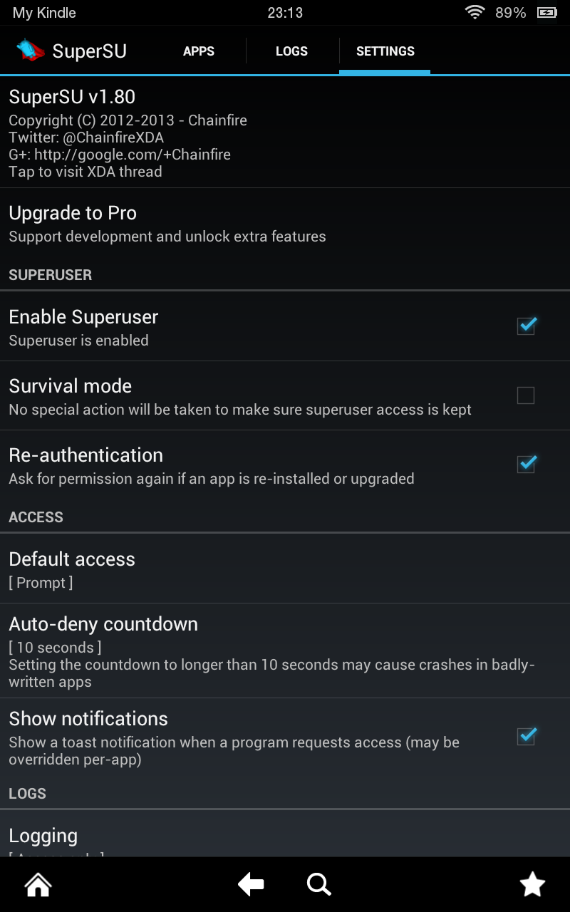

# How to root your Kindle Fire HD 7" (2012)
Last tested on 2025-05-04 on a "fresh" Kindle Fire HD 7  
(it has been factory reset; not signed in to an Amazon account;
no Lock Screen Password)

Remember that it's a good idea to read everything first before beginning.

## Table of Contents
- [How to root your Kindle Fire HD 7" (2012)](#how-to-root-your-kindle-fire-hd-7-2012)
  - [Table of Contents](#table-of-contents)
  - [Prerequisites](#prerequisites)
  - [🐧](#)
  - [Acknowledgements](#acknowledgements)
  - [Preparation](#preparation)
  - [Root Procedure](#root-procedure)
  - [Done!](#done)
  - [Personal Conclusion](#personal-conclusion)
  - ["Factory Cable" (To-Do: figure out where to put this section)](#factory-cable-to-do-figure-out-where-to-put-this-section)

## Prerequisites
- A Kindle Fire HD 7" (2012) with sufficient battery life¹
- A Micro USB Type B (USB 2.0) Male to USB Type A (USB 2.0) Male cable capable
  of data transfer²
- A computer with a USB Type A port² with a version of `adb` that supports the
  `adb restore` command
- The `stuff` folder with those 4 files (`busybox`, `fakebackup.ab`, `su`, and
  `Superuser.apk`)

Notes:  
¹To "be on the safe side", make sure it's charged to over 50% maybe. More is 
better.  
²This method could also work using wireless `adb` (meaning you don't need the
cable), however I have not tested this.

## 🐧
I'm running Linux!


This means I do not need to write `adb.exe` but just `adb`.
Also, it's `/dev/null` instead of `NUL`.

If you're on Windows you may need a specific driver for your Kindle Fire HD 7.
You may also need to get your own `adb.exe`. Those are provided here, though;
See below:

## Acknowledgements
This guide is based on me looking at how the batch script works that would
automate this for you. It contains the following credits:

```
======================================================================
= This script will root your Android phone with adb restore function =
= Script by Bin4ry (thanks to Goroh_kun and tkymgr for the idea)     =
=             Idea for Tablet S from Fi01_IS01                       =
=                      (14.12.2013) v33                              =
======================================================================
```
Also, the bash script:
```
===================================================================================================
=              This script will root your Android phone with adb restore function                 =
= Script by Bin4ry(converted to shell by jamcswain) (thanks to Goroh_kun and tkymgr for the idea) =
=                                Idea for Tablet S from Fi01_IS01                                 =
=                                      (14.12.2013) v33                                           =
===================================================================================================
```
Files sourced from  
https://drive.google.com/file/d/0B14UeDuAgQxReXBaa1hhTHRVSGM/view?resourcekey=0-cimd-dYHAPjfo-3aqTIuUQ  
(ZIP available in this repository) which was found in the description of the
following video by Tekify (Windows users, you can probably just follow this
guide then):  
https://www.youtube.com/watch?v=vpJqq-lTR-k

Other valuable links:
- https://xdaforums.com/t/howto-how-to-install-a-new-os-on-7-kindle-fire-hd-2012-tate.3930149/
- https://androidmtk.com/download-binary-toolkit

## Preparation
On your Linux computer, make sure you have `adb` installed.

You can check by running the following command:
```bash
adb --version
```
for me, I get the following output:
```bash
Android Debug Bridge version 1.0.41
Version 29.0.6-debian
Installed as /usr/lib/android-sdk/platform-tools/adb
```
This version still has `adb restore`, but beware of the warning it gives you if
you're reading this in the future:
```bash
$ adb restore
WARNING: adb restore is deprecated and may be removed in a future release
adb: restore requires an argument
```

If you do not have `adb`, you can install it on Debian-based distros using the
following command:
```bash
sudo apt-get install adb
```
The package also may have previously been called "`android-tools-adb`".

---

Now enable debugging on your Kindle. Swipe from the top to bring down the quick
settings and notifications UI:


Tap on the right-most icon (depicting a + symbol inside a white circle) labelled
"More..."

You will be brought to Settings. Now navigate to Security, the 2nd-to-last
option:


Switch the last option "Enable ADB | Enable Kindle developers to debug over USB"
**On**.


I had also enabled "Allow Installation of Applications | From unknown sources"
which is in _Settings > Device_, but I'm not sure if that's required.

## Root Procedure
Connect your Kindle Fire to your computer.

There are 2 ways to check if your Kindle was recognized by `adb`:
```bash
adb devices
```

```bash
adb wait-for-device
```

The first lists connected devices, in this case the Kindle's serial number.
Its output looks something like this:
```bash
$ adb devices
List of devices attached
----------------        device
```
Of course instead of the `----------------` you should see your Kindle's
serial number without spaces, which you can also see on your Kindle in
_Settings > Device > About_.

The second basically does what it says, when you run it, it waits until a device
is connected. When that happens, the command ends, and you are once again able
to enter in more commands in your terminal session.

---

Change directory (`cd`) to where the `stuff` directory is (you should have
cloned or downloaded this repository) (`Guide_Root/.`; also where the very file
you're reading (`README.md`) is).

If you `cd` into the `stuff` directory then you will have to omit (get rid of,
delete, backspace) `stuff/` in the next 4 of 5 commands.

Now we will copy over the files we need for rooting to a temporary directory on
the Kindle:
```bash
adb push stuff/busybox /data/local/tmp/busybox
adb push stuff/su /data/local/tmp/su
adb push stuff/Superuser.apk /data/local/tmp/.
```

Make `busybox` executable:
```bash
adb shell chmod 755 /data/local/tmp/busybox
```

Time for the exploit. Run the following command:
```bash
adb restore stuff/fakebackup.ab
```
If you look at your Kindle, you should now see the following screen:  


We need to enter one more command, but `adb restore` is waiting for us to do
something. So, start another instance of your terminal emulator by either
opening another tab or opening a new window. Now enter this important command:
```bash
adb shell "while ! ln -s /data/local.prop /data/data/com.android.settings/a/file99; do :; done" > /dev/null
```

Now on your Kindle, press "Restore my data".

Check both instances of your terminal to see that both commands have completed.
Now reboot your Kindle. You can do this in `adb` using the following command:
```bash
adb reboot
```

Now there is one last command to enter, but make sure you're connected to your
Kindle. I prefer using `adb wait-for-device` here. I did notice that I had 
access i.e. was connected while the boot animation was still playing. Although
you probably don't need to, I waited until it loaded the lock screen.

Now for the final command:
```bash
adb shell "/data/local/tmp/busybox mount -o remount,rw /system && /data/local/tmp/busybox mv /data/local/tmp/su /system/xbin/su && /data/local/tmp/busybox mv /data/local/tmp/Superuser.apk /system/app/Superuser.apk && /data/local/tmp/busybox cp /data/local/tmp/busybox /system/xbin/busybox && chown 0.0 /system/xbin/su && chmod 06755 /system/xbin/su && chmod 655 /system/app/Superuser.apk && chmod 755 /system/xbin/busybox && rm /data/local.prop && reboot"
```
This uses `busybox` to do the following:
- remount `/system` as read-write (normally it's mounted as read-only)
- Move `su` and `Superuser.apk` and copy `busybox` from the temporary
  directories we put them in earlier to permanent directories. This also
  installs `Superuser.apk`
- Change owner of `su`, then change Linux `rwx` permissions for the other files.
  This basically makes them usable
- Remove the `/data/local.prop` symlink we made earlier when doing the exploit
- Reboot the system

---

Here are screenshots of my terminal window tabs when I did this:


Note the mistake I made:  
- I ran `adb restore stuff/fakebackup.ab`, pressed "Restore my data", then
  entered the next command. This didn't work, so I used Ctrl+C to cancel it.
  I then ran the fakebackup command again, opened a new tab, _then_ entered the
  next command.

I realized this is what you need to do by looking at what outputs were seen in
cmd in Tekify's video at what times of the process, and also reading the batch
and bash script files. I did also ask ChatGPT about these commands, and it did
actually generate an output that wasn't completely wrong.

## Done!
After your Kindle reboots, you're basically done. You'll find the SuperSU app
when you tap on "Apps" in the home screen. Here's a screenshot of the app (I
already changed some settings though, like the theme):


You may now disconnect `adb` (unplug the cable).

## Personal Conclusion
This was actually a 2nd Kindle Fire I got, so yay, I get to experiment with it.
My "original" one (that we've had for years now), I did actually manage to root
it at some point without a computer. It was some weird looking app with
low-resolution PNGs and written in what seemed like Chinese and some Malaysian.
It felt kind of weird to me, and I always wondered if you can just use `adb` or
something.

Well look at that, you can! And that's what these scripts do. Looking at these
scripts and seeing what gets outputted to the console (cmd) in Tekify's video
as well as... as much as I dislike saying it: ChatGPT, actually made me learn a
bit more how rooting Android works. I never understood how it worked before.

And yes, the process is different for almost every device. Samsung phones
require you to boot into download mode or something.

Next, I wanna try getting the TWRP bootloader on this Kindle. After that, I
wanna see what custom ROMs would work. What's the latest version of Android that
the Kindle Fire HD 7" (2012) can run?

## "Factory Cable" (To-Do: figure out where to put this section)
Reading the XDA forums, I came across the term "Factory Cable"/"Fastboot Cable".
This seems like a modified cable that allows the Kindle to boot into Fastboot
mode, which could allow you to unbrick your device should that happen. These
cables are usually only at the factory though, but it seems like you can hack
together your own cable...

- https://xdaforums.com/t/what-is-a-fastboot-cable-the-stock-usb-cable.2458694/
- https://xdaforums.com/t/how-to-make-fastboot-cable-for-brick-kindle-for-noob-beginner.4543075/

---

Thank you for reading! I've tried to save every link here with
https://web.archive.org/save/,
so hopefully there shouldn't be any 'lost media' or instructions!

2025-05-05