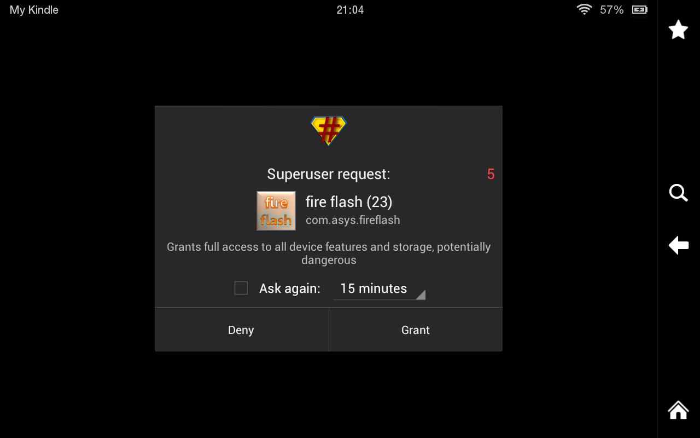
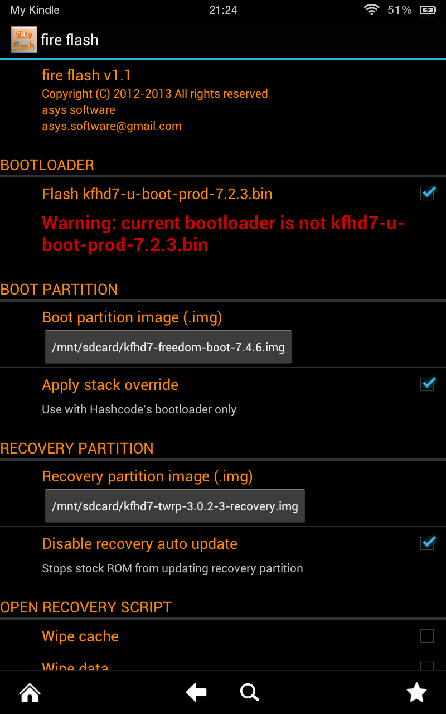
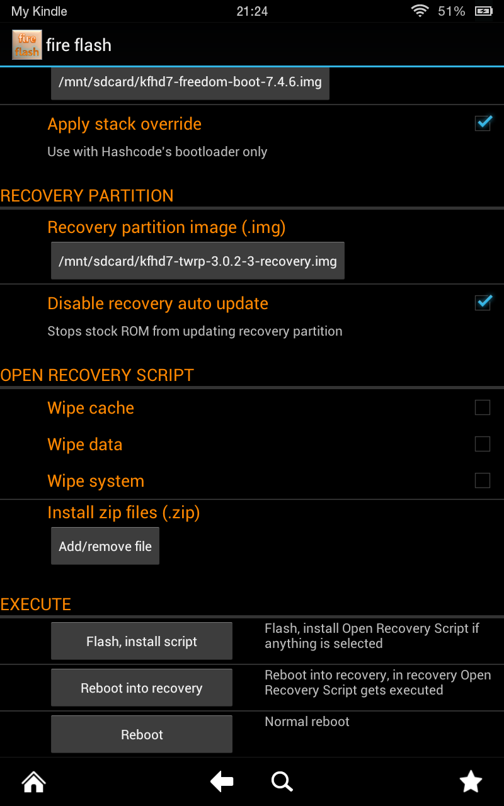
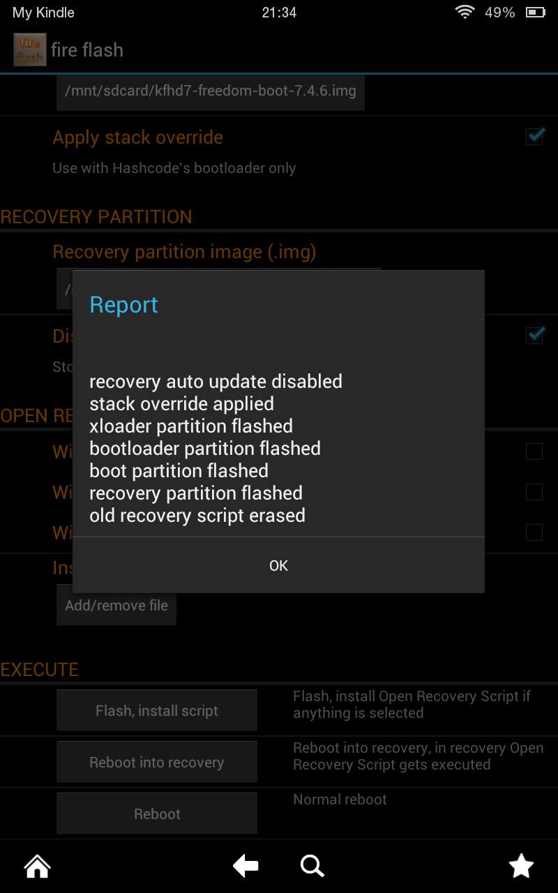
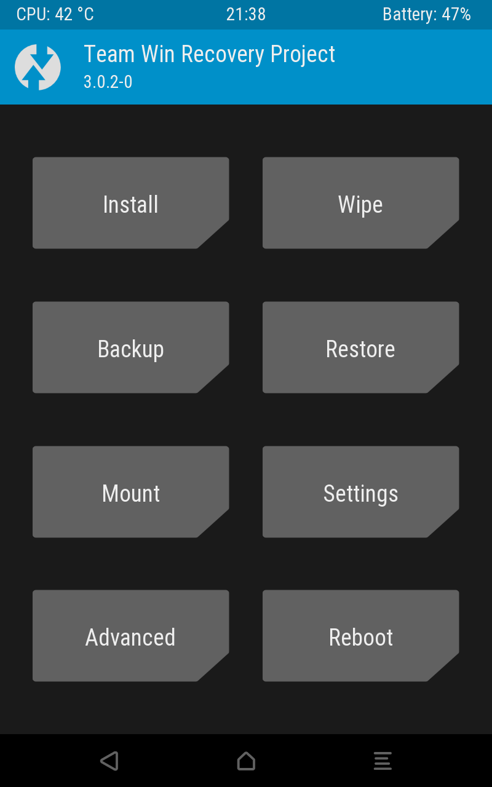

# Putting TWRP on your Kindle Fire HD 7" (2012)

## Sources of the files

### `stuff/FireFlash.apk`
From https://drive.google.com/file/d/0B14UeDuAgQxRRFdzTC01WWxDTXc/view?resourcekey=0-2L7vIAbtnNzrQsRb6L027Q
linked in the description of Tekify's "Install Custom Recovery (TWRP) On Kindle
Fire HD 7 (2012) 7.5.1 (EASY!)" video
(https://www.youtube.com/watch?v=U5_HbmYbGy0)

### `stuff/kfhd7-freedom-boot-7.4.6.img`
From https://drive.google.com/file/d/0B14UeDuAgQxRTjFpQ2RVZ0xwVFU/view?resourcekey=0-1-J-K2rFXmKmr9RLZQjKgQ
linked in the description of Tekify's "Install Custom Recovery (TWRP) On Kindle
Fire HD 7 (2012) 7.5.1 (EASY!)" video
(https://www.youtube.com/watch?v=U5_HbmYbGy0) which has the same md5sum hash of
`1628fc4750d0d49cbce41ab616a9d732` mentioned on
https://xdaforums.com/t/bootloader-2nd-bootloader-for-custom-roms-on-kfirehd-7-06-24-cm12-1-twrp-2-8-7-0.2128848/
at _STEP 2 > 2_

### `stuff/kfhd7-twrp-3.0.2-3-recovery.img`
From https://androidfilehost.com/?w=files&flid=94712 linked on
https://xdaforums.com/t/howto-how-to-install-a-new-os-on-7-kindle-fire-hd-2012-tate.3930149/
at _Step 2_

## Procedure

Put the 3 files in `stuff/` onto your Kindle.  
I then put the 2 `.img` files in `/mnt/sdcard/`.

Install FireFlash.apk

Open it, and grant it superuser permissions:

Now:
- Under BOOTLOADER:
  - Check (enable) the checkbox next to
    "Flash kfhd7-u-boot-prod-7.2.3.bin"
- Under BOOT PARTITION:
  - Tap "Not flashed" under "Boot partition image (.img)", then browse to and
    select  
    `kfhd7-freedom-boot-7.4.6.img`
  - Check (enable) the checkbox next to "Apply stack override"
- Under RECOVERY PARTITION:
  - Tap "Not flashed" under "Recovery partition image (.img)", then browse to
    and select  
    `kfhd7-twrp-3.0.2-3-recovery.img`
  - Check (enable) the checkbox next to "Disable recovery auto update"
- I had my Kindle plugged into my laptop. I unplugged it here.
- Scroll down and tap "Flash, install script"

## Booting into Recovery (now TWRP)
If your Kindle is still on, shut it down by holding the power button until the
shut-down prompt appears, then press the "Shut Down" button.

Now follow these steps to boot into TWRP:
1. Press the power button to turn on your Kindle. You can single-press it, no
   need to long-press it.
2. Very shortly after, when you see the Kindle Fire logo, press and hold the
   volume up button. Keep it held.
3. When the Fire part of the Kindle Fire logo switches from orange to blue,
   wait/count around 3 seconds, then let go of the volume up button (stop
   holding it).
4. After a couple seconds, you should see the TWRP splash screen.

The normal boot process now looks like this:
1. You see the static Kindle Fire logo, where "Fire" is orange.
2. It switches to a different static Kindle Fire logo where the "Fire" is blue.
3. It switches to the animated Kindle Fire logo where the "Fire" is orange, and
   there is a shine animation going from left to right.
4. The boot process finishes and you see the lock screen.

You can use Fire Flash to boot into recovery using the "Reboot into recovery"
button at the bottom. When you do that:
1. You see the static Kindle Fire logo, where "Fire" is orange.
2. It switches to a different static Kindle Fire logo where the "Fire" is red.
3. You see the TWRP splash screen.

---

I also made a backup using TWRP. When it was done, I made a copy of it (using
TWRP > Advanced > File Manager; stuff is in `/sdcard/`) in
Documents and did `chmod 755` so I could do `adb pull /sdcard/Documents/TWRP .`
on my laptop. 